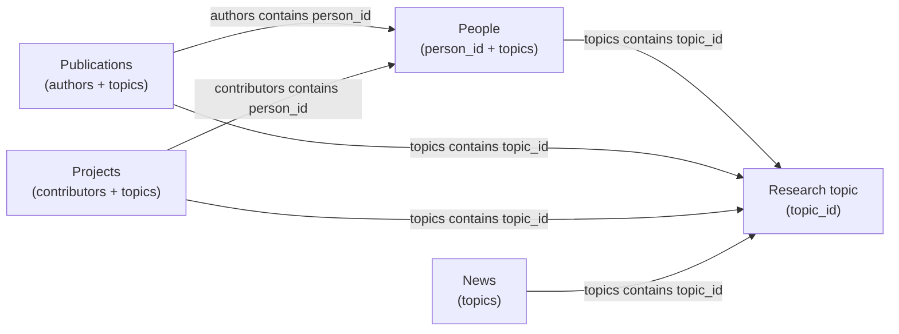

# Vision Group Website — Content & Site Guide

This repository is the **Vision Group** research group website. It is built with **[Jekyll 4](https://jekyllrb.com/)** and styled with the **Block 1.3.2** theme (compiled assets are linked from a sibling directory).

Almost all public content is **Markdown files with YAML front matter**. You do not need to edit HTML templates for day-to-day updates. Items are **linked across the site through tags**:

- **`topic_id`** — research directions (`_research_topics/`)
- **`topics`** — arrays of `topic_id` values on people, publications, projects, and news
- **`person_id`** — stable IDs for group members, referenced by publications and projects

When you tag content consistently, **Research Topic pages**, **People profiles**, and list pages stay in sync automatically.

---

## Table of contents

1. [How content connects](#how-content-connects)
2. [Repository layout](#repository-layout)
3. [Research topics (`_research_topics/`)](#research-topics-_research_topics)
4. [People (`_people/`)](#people-_people)
5. [Publications (`_publications/`)](#publications-_publications)
6. [Projects & demos (`_projects/`)](#projects--demos-_projects)
7. [News (`_news/`)](#news-_news)
8. [Job openings (`_jobs/`)](#job-openings-_jobs)
9. [Site-wide configuration](#site-wide-configuration)
10. [Local build & preview](#local-build--preview)
11. [URL reference](#url-reference)
12. [Assets & media](#assets--media)
13. [Layouts (for maintainers)](#layouts-for-maintainers)
14. [Checklists & troubleshooting](#checklists--troubleshooting)

---

## How content connects



| You edit… | Tag / ID field | Effect |
|-----------|----------------|--------|
| `_people/*.md` | `topics: [ robotics, … ]` | Member appears on `/research/topics/robotics/` and shows topic badges on their profile |
| `_publications/*.md` | `topics: [ … ]` | Paper listed on matching topic pages and shows topic links on the publication page |
| `_publications/*.md` | `authors: [ person_id, … ]` | Paper listed on each member’s profile; “Our group authors” block links to member pages |
| `_projects/*.md` | `topics: [ … ]` | Project card on topic page and in topic “Projects and demos” section |
| `_projects/*.md` | `contributors: [ person_id, … ]` | Contributor list on project page (when not using `external_url` redirect only) |
| `_news/*.md` | `topics: [ … ]` | News card in topic “Related news” section and on `/news/` |

**Rules of thumb**

1. Every string in a `topics` array must match an existing **`topic_id`** in `_research_topics/`.
2. Every string in `authors` or `contributors` must match an existing **`person_id`** in `_people/`.
3. File slugs (e.g. `andrea-alfarano.md`) define URLs; **`person_id` / `topic_id` are separate** and should stay stable even if you rename a file (avoid renaming once linked everywhere).

---

## Repository layout

```
├── _config.yml              # Site title, collections, permalinks, landing/footer
├── Gemfile / Rakefile       # Dependencies; UTF-8-safe build tasks
├── assets -> ../block-1.3.2/dist/assets   # Symlink to Block theme assets
├── site-covers/             # Group-owned images & videos (heroes, demos, sponsors)
├── _includes/               # Fragments (nav, pub rows, project links, …)
├── _layouts/                # Page shells (do not edit for routine content)
│
├── _people/                 # One file per member
├── _research_topics/        # One file per research direction
├── _publications/           # One file per paper
├── _projects/               # Demos / software / external project pages
├── _news/                   # News posts (primary news channel)
├── _jobs/                   # Open positions
│
├── index.md                 # Home page
├── people/index.md          # People overview
├── research/index.md        # Research directions list
├── publications/index.md    # Publication archive
├── demos/index.md           # Projects grid
├── news/index.md            # News grid
├── job/index.md             # Job list
└── blog/index.md            # Redirects to /news/ (legacy path)
```

**Jekyll collections** (see `_config.yml`) turn each folder into typed content with fixed URL patterns. **`_posts/`** is optional legacy blog material; the live **News** section uses **`_news/`** only.

---

## Research topics (`_research_topics/`)

Each research direction is **one Markdown file**. The filename (without `.md`) should match **`topic_id`**.

Example: `robotics.md` → preview at `/research/topics/robotics/`.

### Front matter fields

| Field | Required | Description |
|-------|----------|-------------|
| `topic_id` | **Yes** | Canonical ID; must equal the filename stem. Used in `topics` arrays everywhere. |
| `title` | **Yes** | Page H1 and card title on home / research list. |
| `order` | Recommended | Integer sort key on `/research/` and home cards (lower = earlier). |
| `summary` | Recommended | Short lead paragraph under the title. |
| `hero_image` | Optional | Banner image path (site root, e.g. `/site-covers/topics/robotics/hero.jpg`). |
| `intro_video` | Optional | Reserved / reference; not rendered by default layout. |
| `cover_image` | Optional | Fallback if `hero_image` is unset. |

Do **not** put partner lists in YAML. Use an **“In Cooperation With”** section in the Markdown body (see below).

### Body content (your prose)

- The layout renders **`title`**, **`summary`**, and **`hero_image`** from YAML; you write the long-form description in the body.
- Use **`###`** for sections and **`####`** for subsections only. Do **not** use `##`, `#####`, or raw HTML headings (the page already has an H1).
- Sections **Projects and demos**, **Related news**, **People**, and **Publications** on the topic page are **generated automatically** from tagged items — do not duplicate them in the file.

### Images & video in topic pages

- **Hero:** set `hero_image` in YAML.
- **Inline images:** standard Markdown, or HTML `<figure>` for full-width styling (see `_research_topics/robotics.md`).
- **Video:** wrap in a 16:9 container (bare `<video>` tags will not size correctly):

```html
<div class="ratio ratio-16x9 rounded-3 overflow-hidden shadow-sm bg-dark my-4">
  <video class="object-fit-cover" controls playsinline muted loop poster="/path/to/poster.jpg">
    <source src="/site-covers/home/hero-video.mp4" type="video/mp4" />
  </video>
</div>
```

### Partner logos (“In Cooperation With”)

Add at the end of the file: a short paragraph, then logo HTML:

```html
<div class="topic-cooperation-logos">
  <a href="https://partner.example" target="_blank" rel="noopener" title="Partner Name">
    
  </a>
  
</div>
```

Prefer SVG/PNG under `site-covers/sponsors/` or `site-covers/topics/<topic-id>/`.

### Current topic IDs

| `topic_id` | File |
|------------|------|
| `robotics` | `robotics.md` |
| `space-ai` | `space-ai.md` |
| `3d-vision` | `3d-vision.md` |
| `egocentric-vision` | `egocentric-vision.md` |
| `visual-media` | `visual-media.md` |
| `vision-agent` | `vision-agent.md` |

`_research_topics/robotics.md` is the **reference template** with full examples; copy its patterns when authoring a new topic.

---

## People (`_people/`)

One file per member. URL: `/people/<filename>/` (e.g. `luc-van-gool.md` → `/people/luc-van-gool/`).

### Front matter fields

| Field | Required | Description |
|-------|----------|-------------|
| `person_id` | **Yes** | Unique stable ID. Used in `authors` and `contributors`. Use lowercase hyphenated slugs. |
| `title` | **Yes** | Document title (often full name with title prefix). |
| `name_display` | Recommended | Name shown in UI; defaults to `title` if omitted. |
| `role` | **Yes** | `faculty` \| `phd` \| `postdoc` \| `visitor`. Legacy `student` is grouped with `phd` on the People page. |
| `start_date` | **Yes** | `YYYY-MM-DD` string. Sorts members **within each role section** (earlier join date → higher on page). If two people share a date, use distinct dates (e.g. `2025-09-01` / `2025-09-02`). |
| `order` | Optional | Integer placeholder (default `0`); listing currently uses **`start_date` only**. |
| `topics` | Recommended | Array of `topic_id` values for research badges and topic pages. |
| `title_en` | Optional | Subtitle under name (role / affiliation line). |
| `homepage` | Optional | External profile URL. |
| `photo` | Optional | Image path from site root (e.g. `/site-covers/people/luc.jpg`). |

### Body

Markdown **bio** shown on the member page. **Publications** are listed automatically when `authors` on a publication includes this `person_id`.

### People overview page

`/people/` groups members: **Faculty** → **Postdocs** → **PhD students** → **Visitors**, each sorted by `start_date` ascending.

---

## Publications (`_publications/`)

One file per paper. Filename becomes the URL slug (long descriptive slugs are fine). List page sorts by **`year`** descending.

### Front matter fields

| Field | Required | Description |
|-------|----------|-------------|
| `title` | **Yes** | Paper title. |
| `year` | **Yes** | Publication year (integer). |
| `venue` | Recommended | Full venue string (e.g. conference name and year). |
| `venue_abbr` | Optional | Short label in compact lists (e.g. `CVPR`, `NeurIPS`). |
| `author_line_full` | **Strongly recommended** | Complete author list as plain text (all affiliations). Shown in headers and compact rows. |
| `authors` | Recommended | Array of **`person_id`** values for **group members only**. Powers profile links and “Our group authors”. |
| `author_line` | Optional | Legacy fallback if `author_line_full` is missing. |
| `topics` | Optional | Array of `topic_id` values for topic pages and publication badges. |
| `paper_url` | Optional | External PDF / project page; shows “Paper / project link” button. |
| `cover_image` | Optional | Thumbnail in compact publication rows. |

### Body

Optional abstract or notes (often empty for imports). Author display priority:

1. `author_line_full`
2. else `author_line`
3. else auto-built from `authors` names

---

## Projects & demos (`_projects/`)

Published under **`/demos/`** (collection name is `projects`). Sorted on the grid by **`order`** ascending.

### Front matter fields

| Field | Required | Description |
|-------|----------|-------------|
| `title` | **Yes** | Project name. |
| `tagline` | Recommended | One-line subtitle on cards and project header. |
| `cover_image` | Recommended | Card and hero image (e.g. `/site-covers/demos/portfolio-1.jpg`). |
| `order` | Recommended | Sort position on `/demos/` (lower = earlier). |
| `project_year` | Optional | Display year string. |
| `sidebar_tags` | Optional | Comma-separated labels for internal reference (not heavily used in layout). |
| `topics` | Recommended | `topic_id` array for research topic aggregation. |
| `contributors` | Optional | `person_id` array; shown on on-site project pages. |
| `external_url` | Optional | If set, list cards and `/demos/<slug>/` **redirect** to this URL (new tab). Use for hosted demos outside this repo. |
| `demo_url` | Optional | Second external link (“Live demo”) on **on-site** project pages when `external_url` is not used as the primary link. |

### Body

Project description (shown when the page is not a pure redirect). If only `external_url` is needed, a short note in the body is enough.

---

## News (`_news/`)

One file per announcement. Use a **date-prefixed filename** for clarity, e.g. `2026-05-12-robotics-retreat.md` → `/news/2026-05-12-robotics-retreat/`.

### Front matter fields

| Field | Required | Description |
|-------|----------|-------------|
| `title` | **Yes** | Headline. |
| `date` | **Yes** | `YYYY-MM-DD`; drives sort on `/news/` (newest first). |
| `excerpt` | Recommended | Short summary on cards and under the title on the article page. |
| `topics` | Optional | `topic_id` array for “Related news” on topic pages. |
| `cover_image` | Optional | Card and article hero; random blog placeholder if omitted. |

### Body

Full article text (Markdown).

---

## Job openings (`_jobs/`)

### Front matter fields

| Field | Required | Description |
|-------|----------|-------------|
| `title` | **Yes** | Position title. |
| `location` | Optional | Shown on list and detail (e.g. `On-site · Vision Lab`). |
| `order` | Optional | Sort on `/job/` (lower = earlier). |
| `apply_url` | Optional | Apply button target (`mailto:` or web form). |

### Body

Full job description (Markdown).

---

## Site-wide configuration

| Location | Purpose |
|----------|---------|
| `_config.yml` | `title`, `collections`, `permalink`, `landing` (home hero), `sponsors`, `footer` |
| `_includes/navbar.html` | Main navigation (inner pages) |
| `_includes/navbar-landing.html` | Transparent home navigation |
| `_data/footer.yml` | Optional footer override (included templates prefer `_data` when present) |

After changing collections or permalinks, rebuild the site.

---

## Local build & preview

```bash
bundle install
rake build          # recommended: UTF-8 locale for asset paths
# or
rake serve          # local preview with livereload
```

Dependencies install to **`vendor/bundle/`**. If gems are missing, run `bundle install` again.

Without Rake, set UTF-8 explicitly (some theme assets have non-ASCII filenames):

```bash
LC_ALL=en_US.UTF-8 LANG=en_US.UTF-8 bundle exec jekyll build
LC_ALL=en_US.UTF-8 LANG=en_US.UTF-8 bundle exec jekyll serve
```

Output is written to **`_site/`**.

### After cloning

1. **`assets` symlink** — default target is `../block-1.3.2/dist/assets`. Place this repo next to the Block project, or retarget the symlink. On Windows without symlinks, copy `dist/assets` into `./assets/`.
2. **Sample data** — `_people`, `_publications`, etc. are demonstrators; replace with real metadata while keeping field names stable.

---

## URL reference

With `permalink: pretty`:

| Page | Path |
|------|------|
| Home | `/` |
| People overview | `/people/` |
| Member profile | `/people/<slug>/` |
| Research overview | `/research/` |
| Research topic | `/research/topics/<topic_id>/` |
| Publications list / paper | `/publications/` , `/publications/<slug>/` |
| Demos list / project | `/demos/` , `/demos/<slug>/` |
| News list / article | `/news/` , `/news/<slug>/` |
| Jobs list / posting | `/job/` , `/job/<slug>/` |
| Legacy blog | `/blog/` → redirects to `/news/` |

---

## Assets & media

| Path | Use |
|------|-----|
| `/assets/...` | Block theme CSS, JS, fonts, stock images (via symlink) |
| `/site-covers/...` | Group-specific covers, heroes, sponsor logos, topic media |
| Member `photo`, project `cover_image`, topic `hero_image` | Always root-relative paths starting with `/` |

Upload new group media under **`site-covers/`** and reference it in YAML or Markdown.

---

## Layouts (for maintainers)

Routine editors should **not** change `_layouts/` or `_includes/`. Reference mapping:

| Site section | Layout | Content source |
|--------------|--------|----------------|
| Home | `home.html` | `index.md` + `site.landing` |
| Research list | `research-list.html` | `research/index.md` + `_research_topics/` |
| Research topic | `topic.html` | `_research_topics/*.md` + tagged items |
| People | `people.html` | `_people/` by `role` / `start_date` |
| Member | `person.html` | `_people/*.md` + pubs via `authors` |
| Publications | `publications-list.html`, `publication.html` | `_publications/` |
| Demos | `demos-grid.html`, `project.html` | `_projects/` |
| News | `news-grid.html`, `news.html` | `_news/` |
| Jobs | `job-list.html`, `job.html` | `_jobs/` |

---

## Checklists & troubleshooting

### Adding a new group member

1. Create `_people/<slug>.md` with unique `person_id`, `role`, `start_date`, and `topics`.
2. Add their photo under `site-covers/people/` if available.
3. Tag existing publications with their `person_id` in `authors`.

### Adding a paper

1. Create `_publications/<descriptive-slug>.md` with `title`, `year`, `venue`, `author_line_full`.
2. Set `authors` to group `person_id` list; set `topics` for each relevant direction.
3. Run `rake serve` and check the publication page and each tagged topic page.

### Adding a project or news item

1. Create the Markdown file with `title` and `topics`.
2. For projects, set `cover_image` and either host on-site content or `external_url`.
3. For news, set `date` and `excerpt`; confirm it appears on `/news/` and on topic pages.

### Adding a research direction

1. Add `_research_topics/<topic_id>.md` with matching `topic_id` in YAML.
2. Set `order` among siblings; write body using `###` / `####` only.
3. Tag people, papers, projects, and news with the new `topic_id`.
4. Use `robotics.md` as the authoring reference.

### Common issues

| Symptom | Likely cause |
|---------|----------------|
| Member missing on topic page | `topics` on person file does not include that `topic_id` |
| Paper not on profile | `authors` omits their `person_id` (typo or external-only author) |
| Topic section empty | No items tagged with that `topic_id` in the relevant collection |
| Broken image | Path must start with `/`; file must exist under `site-covers/` or `assets/` |
| Build encoding error | Run build with `LC_ALL=en_US.UTF-8` (use `rake build`) |
| Project opens wrong link | `external_url` overrides on-site page; use `demo_url` for a second button |

---

## Deployment note

For **GitHub Pages** or subpath hosting, set `baseurl` in `_config.yml` and ensure CI uses a UTF-8 locale. Deployment specifics are environment-specific and can be documented separately when needed.
