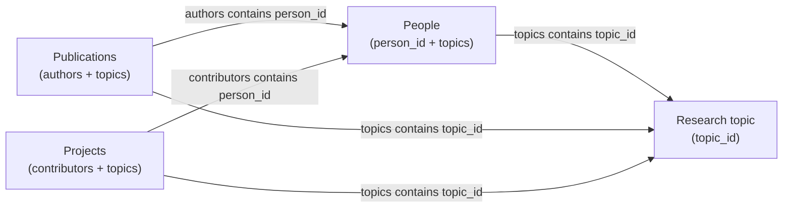

# Vision Lab @ INSAIT — Content & Site Guide

This repository is the website of the **Vision Lab at [INSAIT](https://insait.ai/)**, served at **[vision.insait.ai](https://vision.insait.ai)**. It is built with **[Jekyll 4](https://jekyllrb.com/)** and styled with the **Block** theme (Codescandy Block 1.3.x); the compiled theme assets are committed under `assets/`.

Almost all public content is **Markdown files with YAML front matter** — you do not need to touch HTML templates for day-to-day updates. Content is **linked across the site through shared IDs and tags**:

- **`topic_id`** — a research direction (`_research_topics/`)
- **`topics`** — arrays of `topic_id` values on people, publications, projects, and news
- **`person_id`** — a stable member ID, referenced by publications and projects

Tag content consistently and the **Research Topic pages**, **People profiles**, and every list page stay in sync automatically.

---

## Table of contents

1. [How content connects](#how-content-connects)
2. [Repository layout](#repository-layout)
3. [Research topics (`_research_topics/`)](#research-topics-_research_topics)
4. [People (`_people/`)](#people-_people)
5. [Publications (`_publications/`)](#publications-_publications)
6. [Projects & demos (`_projects/`)](#projects--demos-_projects)
7. [News (`_data/news.yml`)](#news-_datanewsyml)
8. [Job openings (`_jobs/`)](#job-openings-_jobs)
9. [Site-wide configuration](#site-wide-configuration)
10. [Local build & preview](#local-build--preview)
11. [URL reference](#url-reference)
12. [Assets & media](#assets--media)
13. [Layouts (for maintainers)](#layouts-for-maintainers)
14. [Checklists & troubleshooting](#checklists--troubleshooting)
15. [Deployment](#deployment)

---

## How content connects


```mermaid
flowchart LR
  RT["Research topic<br/>(topic_id)"]
  P["People<br/>(person_id + topics)"]
  Pub["Publications<br/>(authors + topics)"]
  Proj["Projects<br/>(contributors + topics)"]
  P -->|topics contains topic_id| RT
  Pub -->|topics contains topic_id| RT
  Proj -->|topics contains topic_id| RT
  Pub -->|authors contains person_id| P
  Proj -->|contributors contains person_id| P
```

| You edit… | Tag / ID field | Effect |
|-----------|----------------|--------|
| `_people/*.md` | `topics: [ robotics, … ]` | Member appears on `/research/topics/robotics/` and shows topic badges on their profile |
| `_publications/*.md` | `topics: [ … ]` | Paper listed on matching topic pages and shows topic links on the publication page |
| `_publications/*.md` | `authors: [ person_id, … ]` | Paper listed on each member's profile; the "Our group authors" block links to member pages |
| `_projects/*.md` | `topics: [ … ]` | Project card on the topic page and in its "Projects and demos" section |
| `_projects/*.md` | `contributors: [ person_id, … ]` | Contributor list on the project page (when not a pure `external_url` redirect) |

**Rules of thumb**

1. Every string in a `topics` array must match an existing **`topic_id`** in `_research_topics/`.
2. Every string in `authors` or `contributors` must match an existing **`person_id`** in `_people/`.
3. File slugs (e.g. `andrea-alfarano.md`) define URLs; **`person_id` / `topic_id` are separate** and should stay stable even if you rename a file. Avoid renaming once an ID is linked across the site.

---

## Repository layout

```
├── _config.yml              # Site title, collections, permalinks, landing/footer
├── _config.dev.yml          # Local-preview override (root URL) — merged by rake serve
├── Gemfile / Rakefile       # Dependencies; UTF-8-safe build tasks
├── CNAME                    # Custom domain (vision.insait.ai)
│
├── assets/                  # Committed Block theme CSS, JS, fonts, images
├── site-covers/             # Group-owned media (heroes, demos, sponsor logos)
│
├── _includes/               # Fragments (nav, pub rows, news rows, project links, …)
├── _layouts/                # Page shells (do not edit for routine content)
├── _data/                   # news.yml, alumni.yml, footer.yml (consumed by Liquid)
│
├── _people/                 # One file per member
├── _research_topics/        # One file per research direction
├── _publications/           # One file per paper
├── _projects/               # Demos / software / external project pages
├── _jobs/                   # Open positions
│
├── index.md                 # Home page (landing layout)
├── people/index.md          # People overview
├── research/index.md        # Research directions list
├── publications/index.md    # Publication archive
├── demos/index.md           # Projects grid
├── news/index.md            # News list (renders _data/news.yml)
├── openings/index.md        # Open positions list
├── sponsorship/index.html   # Sponsorship page (hand-written HTML)
├── blog/index.md            # Redirects to /news/ (legacy path)
└── 404.html                 # Not-found page
```

**Jekyll collections** (see `_config.yml`) turn each `_folder/` into typed content with a fixed URL pattern. **News** and **Alumni** are the exceptions: they are driven by files in **`_data/`**, not collections. For the full map of what ships live vs. maintainer-only paths, see [docs/MAINTENANCE.md](docs/MAINTENANCE.md).

---

## Research topics (`_research_topics/`)

Each research direction is **one Markdown file**. The filename (without `.md`) must match its **`topic_id`**.

Example: `robotics.md` → `/research/topics/robotics/`.

### Front matter fields

| Field | Required | Description |
|-------|----------|-------------|
| `topic_id` | **Yes** | Canonical ID; must equal the filename stem. Used in `topics` arrays everywhere. |
| `title` | **Yes** | Page H1 and card title on the home / research list. |
| `order` | Recommended | Integer sort key on `/research/` and home cards (lower = earlier). |
| `summary` | Recommended | Short lead paragraph under the title. |
| `hero_image` | Optional | Banner image, root-relative (e.g. `/site-covers/topics/robotics/hero.jpg`). |
| `cover_image` | Optional | Fallback used when `hero_image` is unset. |
| `intro_video` | Optional | Reserved / reference; not rendered by the default layout. |

Do **not** put partner lists in YAML — use an **"In Cooperation With"** section in the Markdown body (below).

### Body content (your prose)

- The layout renders **`title`**, **`summary`**, and **`hero_image`** from YAML; you write the long-form description in the body.
- Use **`###`** for sections and **`####`** for subsections only. Do **not** use `##`, `#####`, or raw HTML headings — the page already has an H1.
- The **Projects and demos**, **People**, and **Publications** sections on a topic page are **generated automatically** from tagged items. Do not duplicate them in the file.

### Images & video

- **Hero:** set `hero_image` in YAML.
- **Inline images:** standard Markdown, or an HTML `<figure>` for full-width styling (see `_research_topics/robotics.md`).
- **Video:** wrap in a 16:9 container — a bare `<video>` tag will not size correctly:

```html
<div class="ratio ratio-16x9 rounded-3 overflow-hidden shadow-sm bg-dark my-4">
  <video class="object-fit-cover" controls playsinline muted loop poster="/path/to/poster.jpg">
    <source src="/site-covers/home/hero-video.mp4" type="video/mp4" />
  </video>
</div>
```

### Partner logos ("In Cooperation With")

Add a short paragraph at the end of the file, followed by logo HTML:

```html
<div class="topic-cooperation-logos">
  <a href="https://partner.example" target="_blank" rel="noopener" title="Partner Name">
    
  </a>
  
</div>
```

Prefer SVG/PNG under `site-covers/sponsors/` or `site-covers/topics/<topic-id>/`.

### Current topics

| `topic_id` | File |
|------------|------|
| `robotics` | `robotics.md` |
| `space-ai` | `space-ai.md` |
| `3d-vision` | `3d-vision.md` |
| `egocentric-vision` | `egocentric-vision.md` |
| `visual-media` | `visual-media.md` |
| `vision-agent` | `vision-agent.md` |

`_research_topics/robotics.md` is the **reference template** — copy its patterns when authoring a new topic.

---

## People (`_people/`)

One file per member. URL: `/people/<filename>/` (e.g. `luc-van-gool.md` → `/people/luc-van-gool/`).

### Front matter fields

| Field | Required | Description |
|-------|----------|-------------|
| `person_id` | **Yes** | Unique stable ID, used in `authors` and `contributors`. Lowercase hyphenated slug. |
| `title` | **Yes** | Document title (often the full name, with title prefix). |
| `name_display` | Recommended | Name shown in the UI; defaults to `title` if omitted. |
| `role` | **Yes** | `faculty` \| `postdoc` \| `phd` \| `visitor`. Legacy `student` is grouped with `phd`. |
| `start_date` | **Yes** | `YYYY-MM-DD`. Sorts members **within each role section** (earlier join → higher). Give people distinct dates to break ties (e.g. `2025-09-01` / `2025-09-02`). |
| `topics` | Recommended | Array of `topic_id` values for research badges and topic pages. |
| `order` | Optional | Integer placeholder (default `0`); listing currently sorts by **`start_date` only**. |
| `title_en` | Optional | Subtitle under the name (role / affiliation line). |
| `homepage` | Optional | External profile URL. |
| `photo` | Optional | Image path from the site root (e.g. `/site-covers/people/luc.jpg`). |

### Body

Markdown **bio**, shown on the member page. **Publications** are listed automatically whenever a publication's `authors` includes this `person_id`.

### People overview page

`/people/` groups current members as **Faculty** → **Postdocs** → **PhD students** → **Visitors**, each sorted by `start_date` ascending.

### Alumni (`_data/alumni.yml`)

Former members appear in an **Alumni** section at the bottom of `/people/`, driven by `_data/alumni.yml` — name and link only, no per-person page:

```yaml
- name: Xu Zheng
  link: "https://insait.ai/xu-zheng/"
```

The section is hidden automatically when the list is empty.

---

## Publications (`_publications/`)

One file per paper. The filename becomes the URL slug (long descriptive slugs are fine). The list page sorts by **`year`** descending.

### Front matter fields

| Field | Required | Description |
|-------|----------|-------------|
| `title` | **Yes** | Paper title. |
| `year` | **Yes** | Publication year (integer). |
| `venue` | Recommended | Full venue string (e.g. conference name and year). |
| `venue_abbr` | Optional | Short label for compact lists (e.g. `CVPR`, `NeurIPS`). |
| `author_line_full` | **Strongly recommended** | Complete author list as plain text (all affiliations). Shown in headers and compact rows. |
| `authors` | Recommended | Array of **`person_id`** values, **group members only**. Powers profile links and "Our group authors". |
| `author_line` | Optional | Legacy fallback if `author_line_full` is missing. |
| `topics` | Optional | Array of `topic_id` values for topic pages and publication badges. |
| `paper_url` | Optional | External PDF / project page; renders a "Paper / project link" button. |
| `cover_image` | Optional | Thumbnail in compact publication rows. |

### Body

Optional abstract or notes (often empty for imports). Author display priority:

1. `author_line_full`
2. else `author_line`
3. else auto-built from `authors` names

---

## Projects & demos (`_projects/`)

Published under **`/demos/`** (the collection is named `projects`). The grid sorts by **`order`** ascending.

### Front matter fields

| Field | Required | Description |
|-------|----------|-------------|
| `title` | **Yes** | Project name. |
| `tagline` | Recommended | One-line subtitle on cards and the project header. |
| `cover_image` | Recommended | Card and hero image (e.g. `/site-covers/demos/portfolio-1.jpg`). |
| `order` | Recommended | Sort position on `/demos/` (lower = earlier). |
| `project_year` | Optional | Display year string. |
| `topics` | Recommended | `topic_id` array for research-topic aggregation. |
| `contributors` | Optional | `person_id` array; shown on on-site project pages. |
| `sidebar_tags` | Optional | Comma-separated labels for internal reference (lightly used). |
| `external_url` | Optional | If set, the card and `/demos/<slug>/` **redirect** here (new tab). Use for demos hosted outside this repo. |
| `demo_url` | Optional | A second external link ("Live demo") on **on-site** project pages, when `external_url` is not the primary link. |

### Body

Project description, shown when the page is not a pure redirect. If only `external_url` is needed, a short note in the body is enough.

---

## News (`_data/news.yml`)

The news feed at `/news/` is rendered from **`_data/news.yml`** (layout `news-list`, page shell `news/index.md`). Edit the YAML only — there are no per-item Markdown files and no topic tagging. Entries are grouped by year and sorted newest-first automatically.

```yaml
- date: '2026-06-08'
  body: >-
    INSAIT [showcases 17 accepted papers at CVPR 2026](https://example.org/…)
    with live demos across our research directions.
  link_url: https://example.org/…      # optional: adds a "Read coverage" button
```

| Field | Required | Notes |
|-------|----------|-------|
| `date` | **Yes** | `'YYYY-MM-DD'` (quote it). Drives the day/month badge and year grouping. |
| `body` | **Yes** | Markdown, rendered inline. Use `[text](/people/slug/)` to link members, papers, or demos. |
| `link_url` | Optional | Adds a "Read coverage →" button. Opens in a new tab when it contains `://`. |

There is **no `title` field** — the `body` is the headline. **`/blog/`** redirects here for legacy links.

---

## Job openings (`_jobs/`)

### Front matter fields

| Field | Required | Description |
|-------|----------|-------------|
| `title` | **Yes** | Position title. |
| `location` | Optional | Shown on the list and detail (e.g. `On-site · Vision Lab`). |
| `order` | Optional | Sort on `/openings/` (lower = earlier). |
| `apply_url` | Optional | Apply-button target (`mailto:` or web form). |

### Body

Full job description (Markdown).

---

## Site-wide configuration

| Location | Purpose |
|----------|---------|
| `_config.yml` | `title`, `url`/`baseurl`, `collections`, `permalink`, `landing` (home hero), `sponsors`, `footer`, `logo` |
| `_includes/navbar.html` | Main navigation (inner pages) |
| `_includes/navbar-landing.html` | Transparent navigation on the home page |
| `_data/footer.yml` | Footer content (`_includes/footer.html` prefers `_data` over the `_config.yml` `footer:` block) |

The home page hero, CTAs, sponsor logos, and "Join us" block all live under the `landing:` and `sponsors:` keys in `_config.yml`. **Sponsorship** (`/sponsorship/`) is a hand-written HTML page, not Markdown. After changing collections or permalinks, rebuild the site.

---

## Local build & preview

```bash
bundle install
rake serve          # local preview with livereload (root URL)
# or
rake build          # one-off build (UTF-8 locale set for you)
```

Dependencies install to **`vendor/bundle/`**; re-run `bundle install` if gems are missing. Output is written to **`_site/`**.

`rake serve` / `rake build` merge `_config.dev.yml` so links resolve at the root URL and force a UTF-8 locale (some theme assets have non-ASCII filenames). Without Rake, set the locale yourself:

```bash
LC_ALL=en_US.UTF-8 LANG=en_US.UTF-8 bundle exec jekyll serve --config _config.yml,_config.dev.yml
```

> **Note:** `assets/` is committed to the repo, so a fresh clone builds without any extra setup. (The `.gitignore` excludes an old, broken `assets 2` Block symlink — ignore it.)

---

## URL reference

With `permalink: pretty`:

| Page | Path |
|------|------|
| Home | `/` |
| People overview | `/people/` |
| Member profile | `/people/<slug>/` |
| Research overview | `/research/` |
| Research topic | `/research/topics/<topic_id>/` |
| Publications list / paper | `/publications/` , `/publications/<slug>/` |
| Demos list / project | `/demos/` , `/demos/<slug>/` |
| News | `/news/` |
| Jobs list / posting | `/openings/` , `/openings/<slug>/` |
| Sponsorship | `/sponsorship/` |
| Legacy blog | `/blog/` → redirects to `/news/` |

---

## Assets & media

| Path | Use |
|------|-----|
| `/assets/…` | Block theme CSS, JS, fonts, images (committed in-repo) |
| `/assets/css/site-additions.css` | Vision Lab CSS overrides on top of the theme |
| `/site-covers/…` | Group-specific covers, heroes, sponsor logos, topic media |
| Member `photo`, project `cover_image`, topic `hero_image` | Always root-relative paths starting with `/` |

Upload new group media under **`site-covers/`** and reference it from YAML or Markdown.

---

## Layouts (for maintainers)

Routine editors should **not** change `_layouts/` or `_includes/`. Reference mapping:

| Site section | Layout | Content source |
|--------------|--------|----------------|
| Home | `home.html` | `index.md` + `site.landing` |
| Research list | `research-list.html` | `research/index.md` + `_research_topics/` |
| Research topic | `topic.html` | `_research_topics/*.md` + tagged items |
| People | `people.html` | `_people/` (by `role` / `start_date`) + `_data/alumni.yml` |
| Member | `person.html` | `_people/*.md` + pubs via `authors` |
| Publications | `publications-list.html`, `publication.html` | `_publications/` |
| Demos | `demos-grid.html`, `project.html` | `_projects/` |
| News | `news-list.html` | `_data/news.yml` + `news/index.md` |
| Jobs | `job-list.html`, `job.html` | `_jobs/` |

---

## Checklists & troubleshooting

### Add a group member

1. Create `_people/<slug>.md` with a unique `person_id`, `role`, `start_date`, and `topics`.
2. Add their photo under `site-covers/people/` if available.
3. Tag existing publications with their `person_id` in `authors`.

### Add a paper

1. Create `_publications/<descriptive-slug>.md` with `title`, `year`, `venue`, `author_line_full`.
2. Set `authors` to the group `person_id` list, and `topics` for each relevant direction.
3. Run `rake serve` and check the publication page and each tagged topic page.

### Add a project

1. Create the Markdown file with `title` and `topics`.
2. Set `cover_image`, then either host on-site content or point `external_url` at the hosted demo.

### Update news

1. Edit `_data/news.yml` (newest entries first).
2. Run `rake serve` and check `/news/`.

### Add a research direction

1. Add `_research_topics/<topic_id>.md` with a matching `topic_id` in YAML.
2. Set `order` among siblings; write the body using `###` / `####` only.
3. Tag people, papers, and projects with the new `topic_id`.
4. Use `robotics.md` as the authoring reference.

### Common issues

| Symptom | Likely cause |
|---------|--------------|
| Member missing on a topic page | `topics` on the person file omits that `topic_id` |
| Paper not on a profile | `authors` omits their `person_id` (typo or external-only author) |
| Topic section empty | No items tagged with that `topic_id` in the relevant collection |
| Broken image | Path must start with `/`; the file must exist under `site-covers/` or `assets/` |
| Build encoding error | Build with a UTF-8 locale (use `rake build` / `rake serve`) |
| Project opens the wrong link | `external_url` overrides the on-site page; use `demo_url` for a second button |

---

## Deployment

The live site is served at **[vision.insait.ai](https://vision.insait.ai)** (custom domain in `CNAME`, `baseurl: ""`). For GitHub Pages or subpath hosting, set `url`/`baseurl` in `_config.yml` to match how the site is actually served, and ensure the build runs under a UTF-8 locale. `_config.dev.yml` is a local-only override and is not used by the production build.
